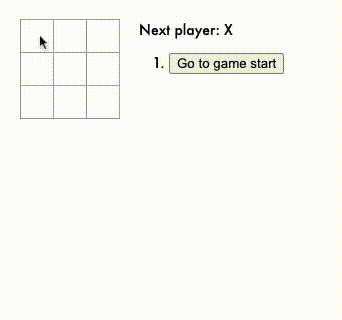

# React Tic Tac Toe with game history

- Lets you play tic-tac-toe,
- Indicates when a player has won the game,
- Stores a game’s history as a game progresses,
- Allows players to review a game’s history and see  previous versions of a game’s board.

